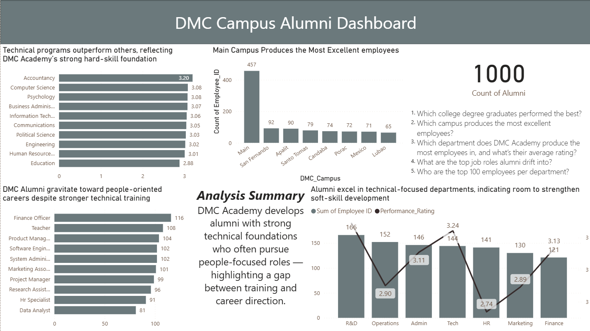
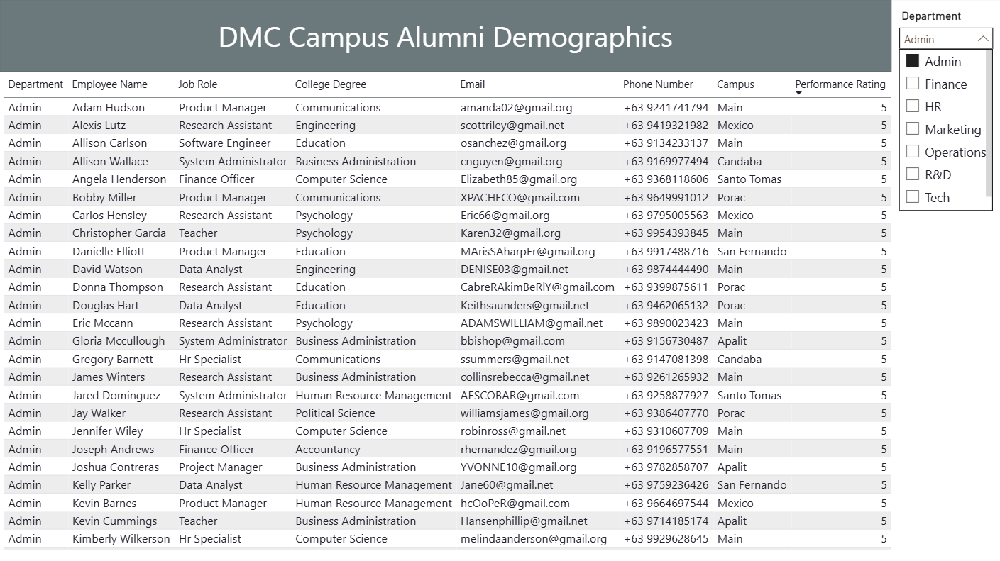

# Alumni-Survey-Supervised-Automated-Data-Pipeline

This project demonstrates a supervised automated data pipeline that automatically ingests raw batches of alumni survey data, transforms them, and loads the cleaned results into a live dashboard.

## 📌 Overview

This is a synthetic version of a real, on-going project that aims to provide a Data Pipeline that converts batches of survey data into actionable and data-backed insights. All process — from data ingestion to the creation of the dashboard — are all automatic except one supervised step: Running the Glue Job (Main Transformation) to ensure reliability and cost efficiency.

## 🧰 Tech Stack
- **AWS Services:** S3, Lambda, Glue, Athena, SNS, EventBridge, CloudWatch  
- **Data Tools:** Power BI, Jupyter Notebooks, Pandas
- **Languages:** Python

## 🧠 Objectives

The survey collects responses from a local University’s alumni to assess demographics and post-graduation performance metrics.
It aims to provide insights into the University’s overall teaching proficiency and career impact by exploring these key questions

  1. Which college degree graduates performed the best?
  2. Which campus produces the most excellent employees?
  3. Which department does DMC Academy produce the most employees in, and what’s their average rating?
  4. What are the top job roles alumni drift into?
  5. Who are the top 100 employees per department?

## ⚙️ Architecture

**Step 1: Schema Validation for Lighter Glue Transformation.**
  
  This step stores and separates Validated schema from Invalid Schema. Since Glue can't gracefully handle issues with the     Schema, this step ensures that only compliant-data proceeds to the Main Transformation. 

**Step 2: Data Transformation.**

  This is where the main transformation occur including deduplication, data standardization, and format normalization.

**Step 3: Data Storage.**

  This is where the cleaned data is stored both in Processed-Data/ and Archive/ "folders". Additionally, the data is also     registered in a Glue Data Catalog 

**Step 4: Global Deduplication.**
  
  Since we are dealing with batches of survey data, this is a crucial step that ensures there are no duplicate records across the multiple uploads. 

**Step 5: Data Analysis.**

  This is where our curated data feeds into a live dashboard

**Step 6: Sending the Dashboard Every Week.**

  While this can be fully automated using tools like Microsoft Power Automate, the process currently remains manually supervised to optimize cost and ensure final data verification before distribution.

## 🔍 Dashboard Preview

##  🧩 Data Pipeline Development Process + Code Snippets

Step-by-step procedure to develop the ETL:
1.	Create an S3 bucket with folders for raw, valid, invalid, transformed, and archive data.
2.	Upload the raw CSV file and connect the Google Sheet to the raw folder for continuous data ingestion.
3.	Create a Lambda function that validates the schema and segregates valid and invalid files into their respective folders.
4.	Set up an SNS topic to notify when new valid rows are added to the valid folder.
5.	Create a Lambda trigger that invokes the SNS topic when X new rows appear in the valid folder.
6.	Set up another SNS topic for invalid data alerts, and a corresponding Lambda trigger that reports whenever X invalid rows are found.
7.	Connect AWS Glue ETL to the valid folder as the source.
8.	Apply cost optimization techniques — such as using worker scaling, job bookmarking, and efficient data formats like Parquet.
9.	Design a configurable transformation logic within the ETL job (parameterized fields, reusable mappings, etc.).
10.	Output the Glue job results to the transformed folder, a Glacier archive for cold storage backups, and a database (Athena-compatible).
11.	Create a Lambda function that runs a SQL query in Athena to CREATE OR REPLACE a deduplicated view.
12.	Set up an SNS topic to notify through Gmail when the Glue or Athena job succeeds.
13.	Create an EventBridge rule to orchestrate the pipeline — automatically invoking the Glue job, the Athena Lambda, and SNS notifications.
14.	Connect Power BI via ODBC to the deduplicated Athena view.
15.	Design and publish a dashboard visualizing performance and alumni metrics.
16.	Use Power Automate to export and email the dashboard to clients weekly.
17.	Apply the least-privilege principle to every IAM role and policy used.
18.	Connect S3, Lambda, and Glue to CloudWatch for centralized error logging and alerting.

🐍 Source Code Reference:
[DMC_Alumni_Scripts.ipynb](DMC_Alumni_Scripts.ipynb)

  Includes:
  - Lambda Schema Validator

  - Glue Job Script
    
  - Lambda-Athena Global Deduplication
    
  - Python Sheet Exporter

🐍 (NEW!) Source Code Reference:
[DMC_Alumni_Scripts_With_checkpoints.ipynb](DMC_Alumni_Scripts_With_checkpoints.ipynb)

  Includes:
  - Lambda Schema Validator (NEW! Accounts for the new datetime column)

  - Glue Job Script (NEW! Accounts for the new datetime column)
    
  - Lambda-Athena Global Deduplication
    
  - Python Sheet Exporter (NEW! Adds timestamps as checkpoints so only new rows are added on subsequent runs)

## 📊 Raw Data :
[DMC_Alumni_Survey_Raw.csv](DMC_Alumni_Survey_Raw.csv)

## ✉️ Contact
For questions, feedback, or collaboration:

**Dylan Cortez**
📧 cortezdylan2135@gmail.com

